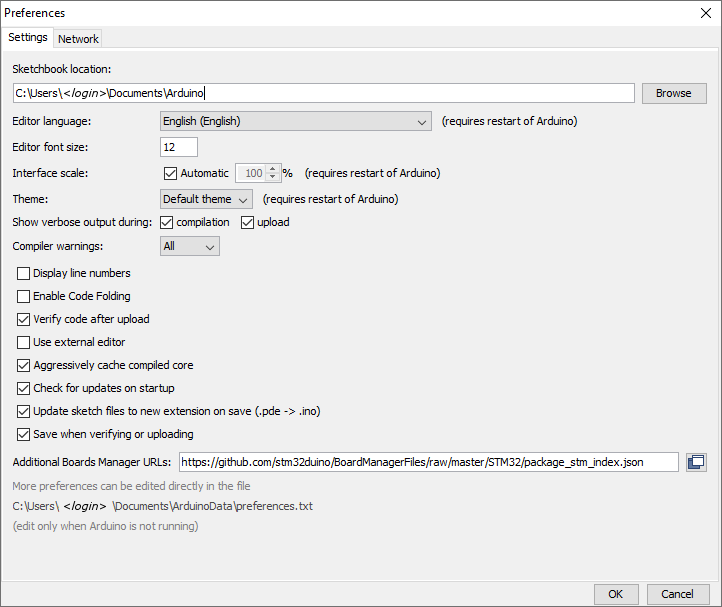
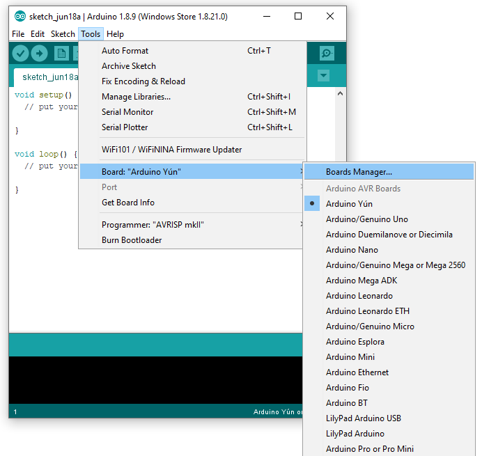
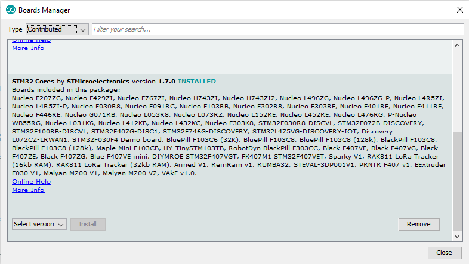
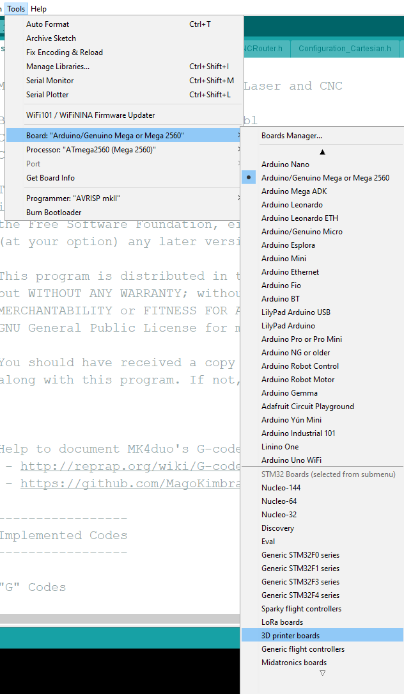
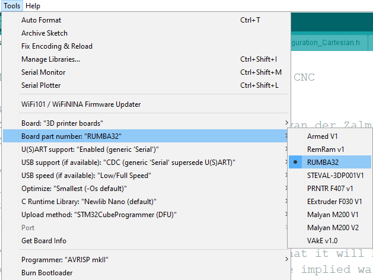
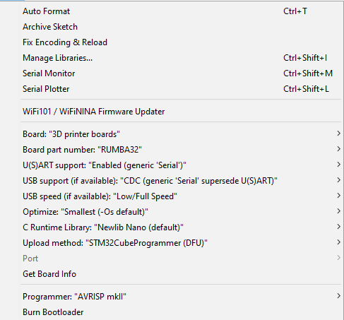

## Installing STM32 Cores

1- Launch Arduino IDE. Click on "**File**" menu and then "**Preferences**".

The "**Preferences**" dialog will open, then add the following link to the "*Additional Boards Managers URLs*" field:

https://github.com/stm32duino/BoardManagerFiles/raw/master/STM32/package_stm_index.json

Click "**Ok**"

2- Click on "**Tools**" menu and then "**Boards > Boards Manager**"

The board manager will open and you will see a list of installed and available boards. 

Select "**Contributed**" type.

Select the "**STM32 Cores**" and click on install.
After installation is complete an "*INSTALLED*" tag appears next to the core name. 

You can close the Board Manager.

3- To upload through SWD (STLink), Serial or DFU, [STM32CubeProgrammer](https://www.st.com/en/development-tools/stm32cubeprog.html) needs to be installed.

Now you can find the STM32 boards package in the "**Board**" menu.

4- Select the desired boards series: Rumba32

5- Setting all option in this mode

## Upload process:

1- Press and hold RUMBA32 BOOT button.

2- Press and release RUMBA32 RESET button.

3- Release RUMBA32 BOOT button.

4- RUMBA32 is now in hardware bootloader mode and will accept firmware upload via USB DFU.

5- Press "Upload" in Arduino IDE. If correctly configured and connected, the upload should be successful
